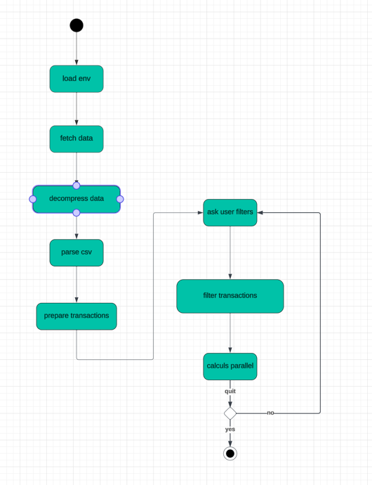

# eScalaDe

## Overview

In today's data-driven world, being able to extract insights from large datasets is a marketable and highly sought-after
skill. This project give us experience in data collection, preprocessing, analysis,
which are fundamental skills applicable in numerous industries.
So we design this ZIO/Scala project to process and analyze transaction data from the real estate
market. It fetches data from a specified URL, decompresses it if necessary, parses the data, and applies various filters
to extract meaningful insights.

## Features

- Environment Variable Loading: Utilizes the Dotenv library to load essential configurations.\
- Data Fetching: Retrieves data from a given URL using an HTTP client within the ZIO environment.\
- Data Decompression: Handles gzipped data streams.\
- CSV Parsing: Parses CSV data into Transaction objects.\
- Data Filtering: Applies filters to transaction data based on user input.\
- Metrics Computation: Calculates various metrics from the filtered data.\

## Prerequisites

- Scala
- sbt (Scala Build Tool)
- A `.env` file containing `DATA_URL, START_YEAR, END_YEAR`, and optionally `CSV_SEPARATOR`.
- Installation
  Clone the repository:

```bash
git clone [repository-url]
```

Navigate to the project directory:

```bash
cd [project-directory]
```

Compile the project using sbt:

```bash
sbt run
```

Follow the prompts to input filters and view the computed metrics based on the transaction data.

## Development

### Key Components

**loadEnvVars**: Loads necessary environment variables.\
**fetchData**: Fetches and processes data from a URL.\
**decompressGzippedData**: Decompresses gzipped data streams.\
**parseCsvLine**: Parses a line of CSV into a Transaction object.\
**validateTransaction**: Validates and filters transactions.\
**loadTransactions**: Loads transactions for a range of years.\
**computeMetrics**: Computes various metrics from transaction data.\
**getUserFilters**: Interactively gets user-specified filters.\
**filterTransactions**: Applies filters to transaction streams.\

### Function Schema



## External Libraries

- **ZIO**: It is a functional programming library for Scala that provides concurrency and asynchronous programming
  features.

- **ZIO-Streams**: Is an extension of ZIO for handling streaming data. We use it to manage and process data
  streams efficiently.

- **ZIO-HTTP**: Is for making HTTP requests and handling any other web-related operations.

- **Dotenv-Java**: It helps us loadings environment variables from a .env file. So we can manage configuration settings and
  secrets in a secure manner.

- **Munit and Munit-ZIO**: It's our testing framework for Scala, and Munit-ZIO is an extension to it to use
  with ZIO.

## Project Structure

**src/main/scala :**

This is the main source directory for our Scala code:

- example/helpers - The helpers package contains utility classes and functions that provide common functionality across
  our application, such as environment configuration (Env), HTTP utilities (Http), and parsing logic (Parser).

- example/models - The models package contains domain model classes that represent the core entities in our application,
  such as Location, Metric, RealEstate, Transaction, and UserFilters. These are case classes that encapsulate the data
  of our application.

- example/services - The services package define business logic and service layer components. It includes services for
  filtering data (Filters), data output (Sinks), and handling transaction-related operations (Transactions).

- example/types - The types package probably type definitions, type aliases, or domain-specific types used throughout
  the application.

**Main** - This is our main application entry point, where we set up our application and start the process.\

**src/test** - This directory includes unit, integration, and functional tests for our Scala code.

## Testing

Run unit tests using sbt:

```bash
sbt test
```