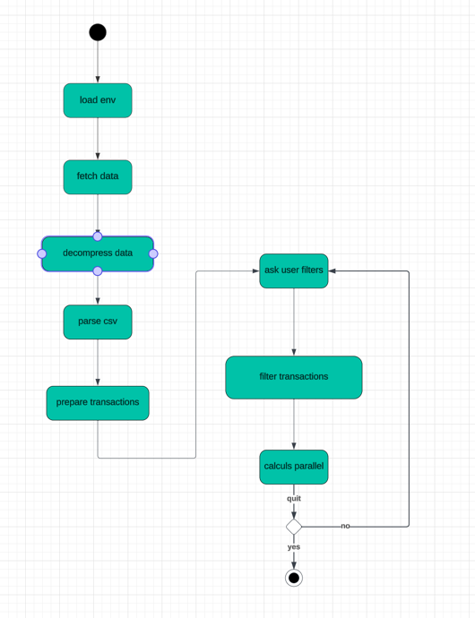

# **eScalaDe**

## **Motivation**

In today's data-driven world, being able to extract insights from large datasets is a marketable and highly sought-after
skill. This project gives us experience in data collection, preprocessing, and analysis, which are fundamental skills
applicable in numerous industries.

We designed this ZIO/Scala project to process and analyze transaction data from the real estate market of France. It
fetches data from a specified URL, a public government URL (https://files.data.gouv.fr/geo-dvf/), decompresses it if
necessary, parses the data, and applies various filters to extract meaningful insights.

We were interested in exploring different kinds of metrics and potentially observing the evolution of France's real
estate market through the years, especially during the ongoing housing crisis. This tool also aims to provide a view of
France's disparities and housing scarcity.

---

## **Prerequisites**

- Scala
- sbt (Scala Build Tool)
- A `.env` file containing `DATA_URL, START_YEAR, END_YEAR`, and optionally `CSV_SEPARATOR`
- A fairly good internet connection (we're fetching approximately 3 Go of data)

## **Clone the Repository**

```bash
git clone https://github.com/YanisBmdn/eScalaDe.git
cd escalade
```

## **Run the Project**

Compile the project using sbt:

```bash
sbt run
```

Follow the prompts to input filters and view the computed metrics based on the transaction data.

## **Run Tests**

Run unit tests using sbt:

```bash
sbt test
```

---

# Quick run through

After compiling and launching the app, the user will be prompted to input different values to filter data


Then, the user will be able to input values, or let the fields empty


After some time (depending on the quantity of data), the program will print the results of the computed metrics of the
data filtered by the user criterias


---

# **Technical Overview**

## **Data Processing Pipeline**

### **Fetching**

- **loadEnvVars**: Loads necessary environment variables.
- **fetchData**: Fetches and processes data from a URL.
- **decompressGzippedData**: Decompresses gzipped data streams.
- **parseCsvLine**: Parses a line of CSV into a Transaction object.

### **Cleaning**

- **loadTransactions**: Loads transactions for a range of years.
- **validateTransaction**: Validates and filters transactions.
- **filterTransactions**: Applies filters to transaction streams.

### **Processing**

- **computeMetrics**: Computes various metrics from transaction data.

The workflow is illustrated in the following [Functional Schema](#Functional-Schema) section.

### **Functional Schema**



## **Project Structure**

**src/main/scala:**

- **example/helpers**: Contains utility classes and functions for environment configuration (Env), HTTP utilities (
  Http), and parsing logic (Parser).
- **example/models**: Contains domain model classes like Location, Metric, RealEstate, Transaction, and UserFilters.
- **example/services**: Defines business logic and service layer components, including Filters, Sinks, and Transactions.
- **example/types**: Contains type definitions, type aliases, or domain-specific types.

**Main**: The main application entry point.

**src/tests**: Includes unit tests for our Scala code.

## **Data Structures**

In our models package, we aimed for a balance between comprehensiveness and simplicity. We introduced a number of case
classes to represent key elements of real estate transaction data, ensuring each data type is encapsulated clearly.
Additionally, we incorporated Opaque Types to provide strong typing, enhancing code clarity and safety. This approach
allows us to handle complex data while maintaining readability and reducing the potential for type-related errors.

## **Performance**

Data fetching is the most **resource-intensive** aspect of our project, which we tried our best to optimize. By cleaning
data and using user-input-based filters, we drastically reduce the dataset for processing. We also maximized
parallelization in the `computeMetrics` method, improving the time taken to run all computations.

## **External Libraries**

- **ZIO**: A functional programming library for Scala, providing concurrency and asynchronous programming features.
- **ZIO-Streams**: An extension of ZIO for managing and processing data streams.
- **ZIO-HTTP**: Used for making HTTP requests and handling web-related operations.
- **Dotenv-Java**: Helps in loading environment variables from a .env file.
- **Munit and Munit-ZIO**: The testing framework for Scala, with Munit-ZIO extending its use with ZIO.

## **Challenges and Learnings**

We faced significant challenges in this project, particularly with Scala and ZIO, as these were new to us. We are proud
of the features we implemented, which were largely in line with our initial goals. Learning to think functionally was a
substantial shift, especially without prior experience in functional languages.